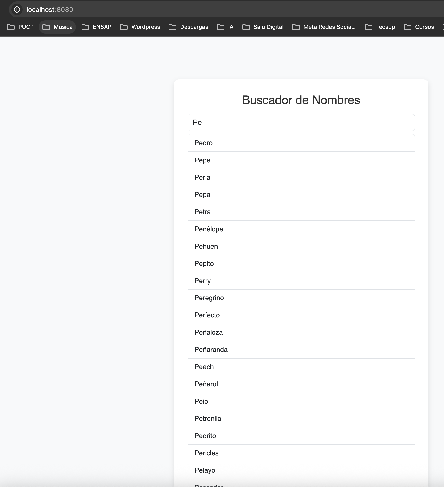
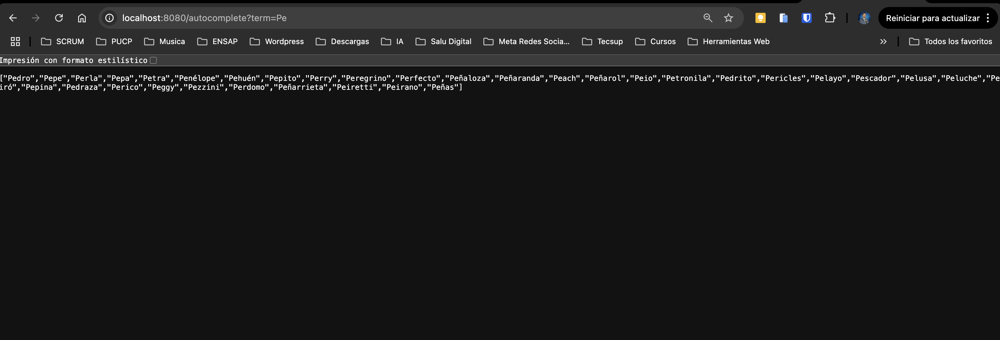
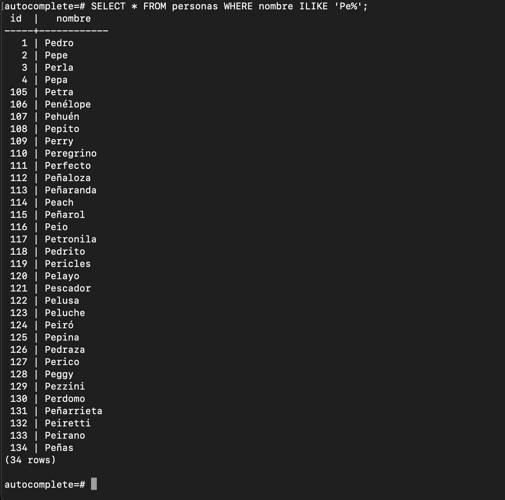

# Autocomplete con Java Servlets y PostgreSQL (Dockerizado)

Este proyecto es una aplicación web simple que implementa una funcionalidad de autocompletado utilizando **Java Servlets**, **PostgreSQL** y **Docker**.

Cuando un usuario escribe un nombre, la aplicación consulta la base de datos y devuelve sugerencias que coinciden con lo escrito (`LIKE 'Pe%'` por ejemplo).

---

## 🌐 Proyecto en línea

▶️ Este proyecto tiene un deploy en el siguiente enlace:

👉 **[https://proyecto-autocomplete.onrender.com/](https://proyecto-autocomplete.onrender.com/)**

---

## 🧱 Estructura del proyecto

```bash

pagina_autocomplete/
├── Dockerfile
├── docker-compose.yml
├── init.sql
├── src/
│ └── main/
│ └── java/
│ └── com/
│ └── ejemplo/
│ └── AutocompleteServlet.java
├── web/
│ └── index.html
├── webapp/
│ └── WEB-INF/
│ └── web.xml
└── README.md
```

## 🚀 Tecnologías usadas

⚙️ Java 17+

🌐 Servlets (Jakarta EE 6)

🐱 Apache Tomcat 10

🐘 PostgreSQL 15

🐳 Docker / Docker Compose

## 🐳 Cómo levantar el proyecto

1. Clona el repositorio:

   ```bash
   git clone https://github.com/tu_usuario/pagina_autocomplete.git
   cd pagina_autocomplete
    ```

2.  Ejecuta el proyecto con Docker Compose:
    ````bash
    docker-compose up --build
    ````
   
3.  Realice puebas desde el navegador

    ```html
    http://localhost:8080/

    http://localhost:8080/autocomplete?term=Pe

    ```
4. Los resultado que tuve fueron:

🔎 Autocompletado desde el navegador



📦 Respuesta en formato JSON



🧮 Base de datos PostgreSQL




### 📦 init.sql
El archivo init.sql crea y llena la base de datos automáticamente al levantar el contenedor de PostgreSQL. Ejemplo:

```sql

CREATE TABLE IF NOT EXISTS personas (
    id SERIAL PRIMARY KEY,
    nombre VARCHAR(255)
);

INSERT INTO personas (nombre) VALUES
('Petra'),
('Penélope'),
('Pehuén'),
...
('Peñas');

```
## 📄 Ejemplo de Servlet (AutocompleteServlet.java)

```java

@WebServlet("/autocomplete")
public class AutocompleteServlet extends HttpServlet {
    // Lógica para conexión a PostgreSQL y responder JSON con coincidencias
}

```

⚙️ Docker Compose (con volumen persistente)
El volumen db_data asegura que los datos de la base no se borren al reiniciar o parar los contenedores.

```yaml
volumes:
  db_data:

```

## 🧑‍💻Autor

- Ing. Styp Canto Rondón
- Proyecto académico - Curso Java Cibertec (Tarea 2)

##  🚀 Despliegue en la nube
- Este proyecto está desplegado gratuitamente en Render.

